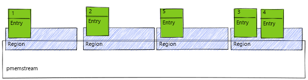

# pmemstream

## ⚠️ Discontinuation of the project
The **pmemstream** project will no longer be maintained by Intel.
- Intel has ceased development and contributions including, but not limited to, maintenance, bug fixes, new releases,
or updates, to this project.
- Intel no longer accepts patches to this project.
- If you have an ongoing need to use this project, are interested in independently developing it, or would like to
maintain patches for the open source software community, please create your own fork of this project.
- You will find more information [here](https://pmem.io/blog/2022/11/update-on-pmdk-and-our-long-term-support-strategy/).

## Introduction

`pmemstream` is a logging data structure optimized for persistent memory.

*This is experimental pre-release software and should not be used in production systems.
APIs and file formats may change at any time without preserving backwards compatibility.
All known issues and limitations are logged as GitHub issues.*

**Libpmemstream** implements a pmem-optimized log data structure and provides stream-like access to the data.
It presents a contiguous logical address space, divided into regions, with log entries of arbitrary sizes.
We intend for this library to be a foundation for various, more complex higher-level solutions.

This library is a successor to [libpmemlog](https://pmem.io/pmdk/libpmemlog/). These two libraries are very similar
in basic concept, but *libpmemlog* was developed in a straightforward manner and does not allow easy extensions.

For more information, including **C API** documentation see [pmem.io/pmemstream](https://pmem.io/pmemstream).

## Table of contents
1. [Build and install](#build-and-install)
2. [Contact us](#contact-us)

## Build and install
[Installation guide](INSTALL.md) provides detailed instructions how to build and install
`pmemstream` from sources, build rpm and deb packages, and more.

## Contact us
For more information about **pmemstream**, please:
- read our whitepaper [attached to 0.2.1 release](https://github.com/pmem/pmemstream/releases/download/0.2.1/Libpmemstream_whitepaper.docx),
- post on our **#pmem** Slack channel using
[this invite link](https://join.slack.com/t/pmem-io/shared_invite/enQtNzU4MzQ2Mzk3MDQwLWQ1YThmODVmMGFkZWI0YTdhODg4ODVhODdhYjg3NmE4N2ViZGI5NTRmZTBiNDYyOGJjYTIyNmZjYzQxODcwNDg)
or [Google group](https://groups.google.com/g/pmem),
- you can reach us out using the dedicated email: pmdk_support@intel.com.
